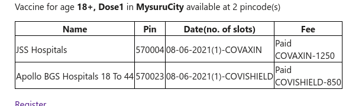

# India Covid vaccination slot e-mail alert
A script to enquire when a covid vaccination slot opens up at a place / set of places in India and to send an email to the subscribers.\
The script <code>vaccine_check_variable_frequency.py</code> uses subscriber groups that have in common 
  * district code (mandatory)
  *  set of pincodes if requried
  *   age (mandatory)
  *   dose number (mandatory)
  *   future_date if required
  *   preference for hospital(enter hospital code) if required
  *   list of emails (mandatory)
  *   choice of vaccine if required
  * scale ( if requrired for adjusting the polling frequency for a particular group)
  
By default script polls once every <b>20seconds</b>. 'scale' parameter can be used to adjust the polling frequency. E.g if it's set to 3 for a group, data for that group will polled once in a minute. An email is sent once everytime a new a slot opens up for a group. You will run this locally and need to add your email-id and password to send out emails.

This was not hosted on any cloud platform, script  <code>vaccine_check_variable_frequency.py</code> is executed locally from the terminal <code>python3 vaccine_check_variable_frequency.py</code> and calls the [API Setu](https://apisetu.gov.in/public/marketplace/api/cowin) opened by the Govt.

**Other Scripts to run as a cron job**
The script <code>covid_vacc_slot_enquiry.py</code> makes the api calls and sends an email if any slots open up in the next 'n' days, where n=3 by default.

Another script <code>cowin_appointment_check.py</code> makes the api calls and sends an email if any slots open up in the next 7 days(fixed). This is working script but there is a delay in fetching the data compared to the former script and is used only for locations where the demand is low.

Take note that only district_code and subscribes list and any dependencies(restricted pin/ restricted hospital codes) for filtering needs to be filled in.\
<code>vacc_check.sh</code> is the file executed by the local cronjob which logs the result of the previous operation that includes status_code(200/403 etc..) and time and name of the center last pinged to a file.

Email content\

