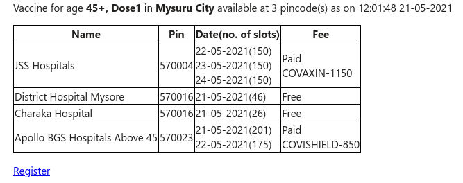

# India Covid vaccination slot e-mail alert
A script to enquire when a covid vaccination slot opens up at a place / set of places in India and to send an email to the subscribers.\
The script uses subscriber groups that have in common 
  * district code
  *  set of pincodes if requried
  *   age
  *   dose number
  *   future_date if required
  *   preference for hospital(enter hospital code) if required
  *   list of emails
  

This was not hosted on any cloud platform, a local cronjob used to run the script every minute to make calls to the api opened by the Govt. [API Setu](https://apisetu.gov.in/public/marketplace/api/cowin)

The script <code>cowin_appointment_check.py</code> makes the api calls and sends an email if any slots open up in the next 7 days(fixed). \
The script <code>covid_vacc_single_day.py</code> makes the api calls and sends an email if any slots open up in the next 'n' days, where n=2 by default. This should be the **preferred script** to use as, by observation updates from this api are latest compared to using api to fetch data for 7 days. \
Both the above scripts call different api's.\
Take note that only district_code and subscribes list and any dependencies(restricted pin/ restricted hospital codes) for filtering needs to be filled in.\
<code>vacc_check.sh</code> is the file executed by the local cronjob which logs the result of the previous operation that includes status_code(200/403 etc..) and time and name of the center last pinged to a file.

Email content\

